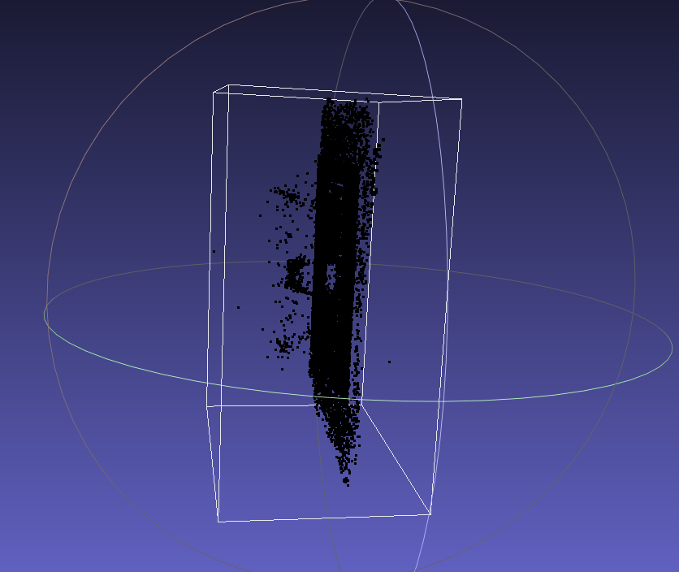

 

# Training NeuS Using Your Custom Data


### [Example data link](https://drive.google.com/file/d/1nZBY--rvi3dUKGVz-d1jCpppkeD_tBiB/view?usp=sharing)


### Option 1. Use ArUco 

We take the images in `examples/thin_catbus` for example. These images were captured with an ArUco board. The pattern image of this board can be found in `./static/aruco_board.png`.

**Step 1. Build the calibration code (c++)**  

Dependencies: 

- cnpy (https://github.com/rogersce/cnpy)
- OpenCV

Run commands

```
cd aruco_preprocess
mkdir build
cd build
cmake .. & make
cd ..
```

**Step 2. Get the preprocessed data**

First indicate `data_dir`,`n_images` in `run.sh`. For example, `data_dir=./example/thin_catbus`

Run commands

```
bash run.sh
```

Then the preprocessed data can be found in `${data_dir}/preprocessed`. Here we define the region of interest as the bounding sphere of the calibration board.


### Option 2. Use COLMAP

**Step 1. Run COLMAP SfM**

Run  commands

```
cd colmap_preprocess
python img2poses.py ${data_dir}
```

After running the commands above, a sparse point cloud is saved in `${data_dir}/sparse_points.ply`.

**Step 2. Define the region of interest**

The raw sparse point cloud may be noisy and may not be appropriate to define a region of interest (The white frame indicates the bounding box of the point cloud):


And you may need to clean it by yourself (here we use Meshlab to clean it manually). After cleaning:



Save it as `${data_dir}/sparse_point_interest.ply`.

Then run the commands:

```
python gen_cameras.py ${data_dir}
```

Then the preprocessed data can be found in `${data_dir}/preprocessed`.

### Notes

Here we just use the image without undistortion in the second option. To get better results, you may need to undistort your images in advance.


## Acknowledgement

The python scripts to run COLMAP SfM are heavily borrowed from LLFF: https://github.com/Fyusion/LLFF

